# [Создание платформера на Python, используя pygame](https://github.com/dzyundzya/platformer_pygame)

### Содержание:

1. [О проекте](#о-проекте)
2. [Интерфейс проекта](#интерфейс-проекта)
3. [Как запустить](#как-запустить)
4. [Проект сделал](#проект-сделал)
 

## О проекте

Таблетница — это веб-приложение для эффективного управления лекарственными препаратами и их систематизации. Проект создан для помощи пользователям в организации и контроле приема медикаментов.

Проект «Таблетница» призван сделать процесс управления лекарствами более организованным и эффективным, помогая пользователям следить за своим здоровьем и своевременно принимать необходимые препараты.

* __Каталог препаратов:__ систематизированный список лекарств с подробными описаниями. 
* __Персональные списки:__ возможность создания индивидуальных таблеточниц. 
* __Система напоминаний:__ уведомления о необходимости приема препаратов с помощью Telegram-бота. 
* __Профили пользователей:__ личный кабинет с историей и настройками пользователя и администратора. 
* __Комментарии и отзывы:__ обмен опытом между пользователями. 

## Интерфейс проекта

`Логин, о проекте, правила:`

  
  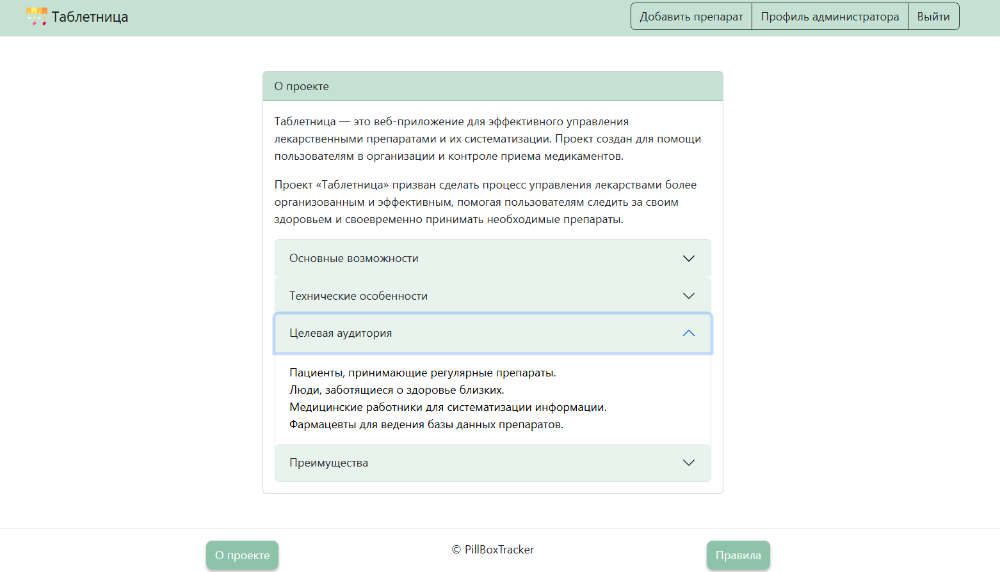
  

`Интерфейс создания, редактирования и удаления препарата:`

  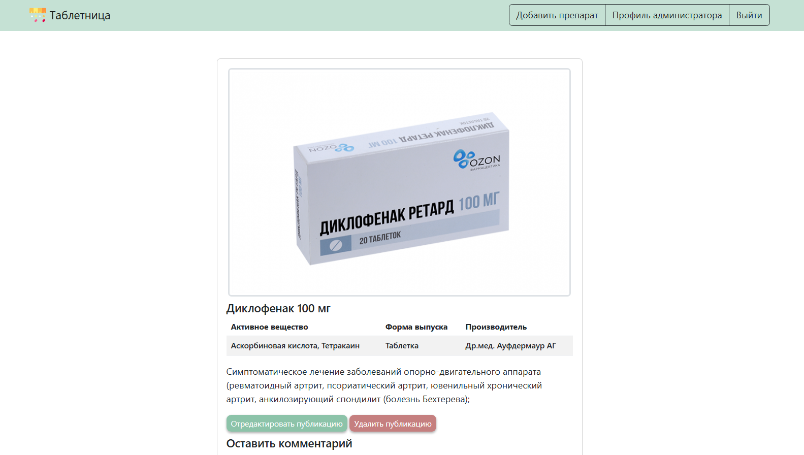
  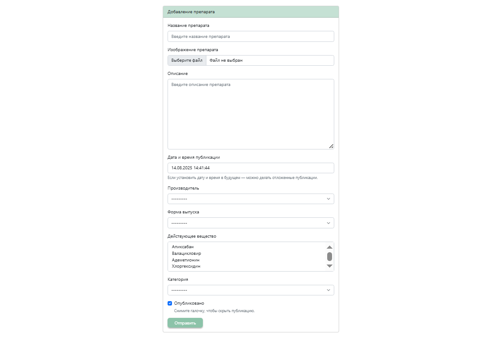
  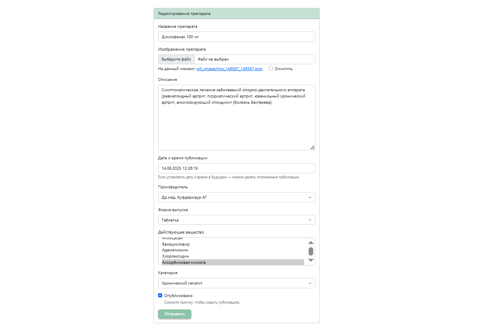
  

`Интерфейс создания, редактирования и удаления таблеточницы:`

  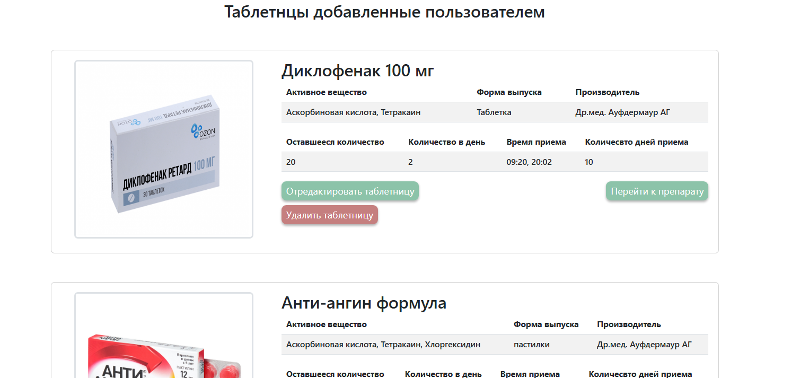
  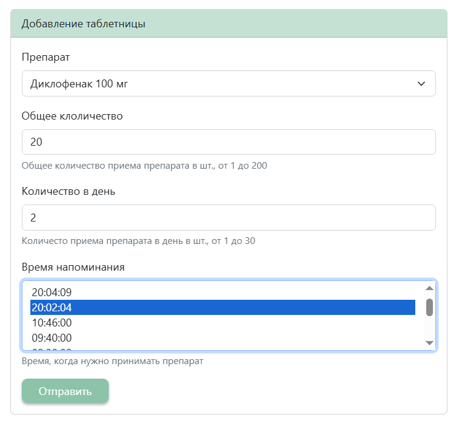
  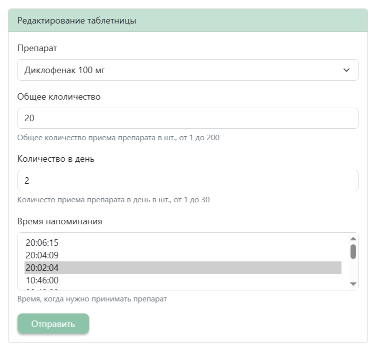
  

`Интерфейс комментария:`

  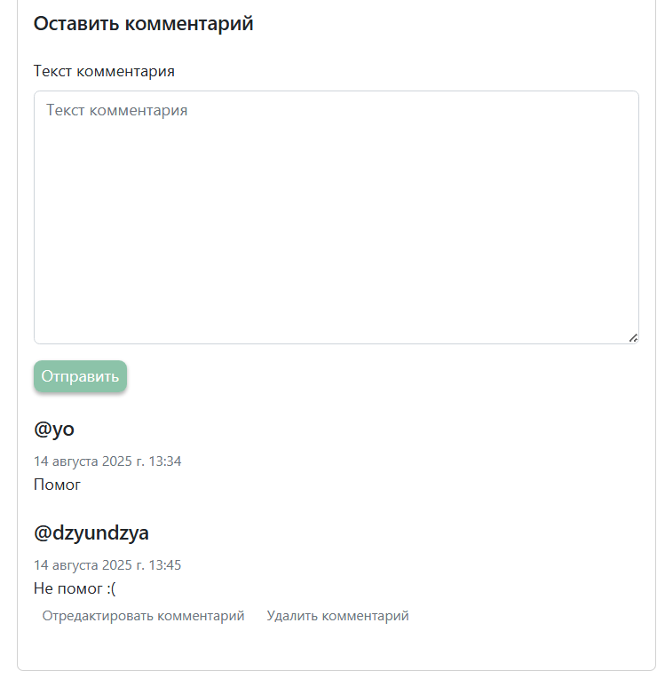
  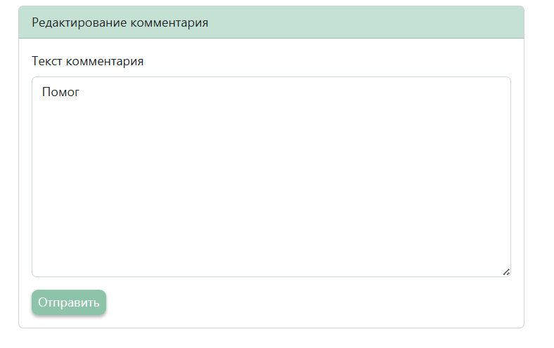
  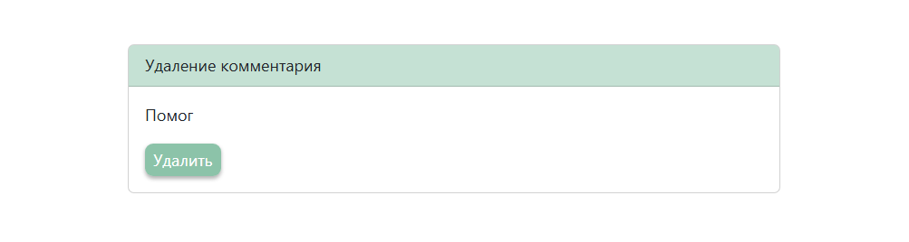

`Интерфейс страницы администратора и пользователя:`

  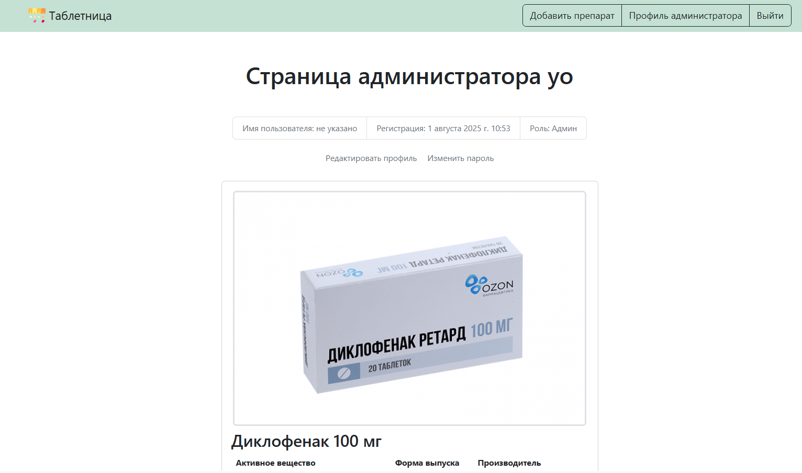
  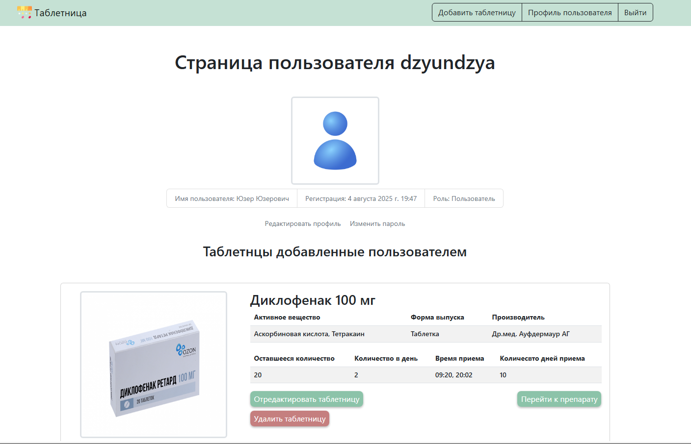

`Работа уведомлений телеграм-бота:`

  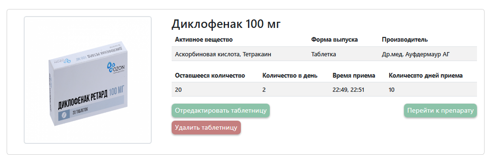
  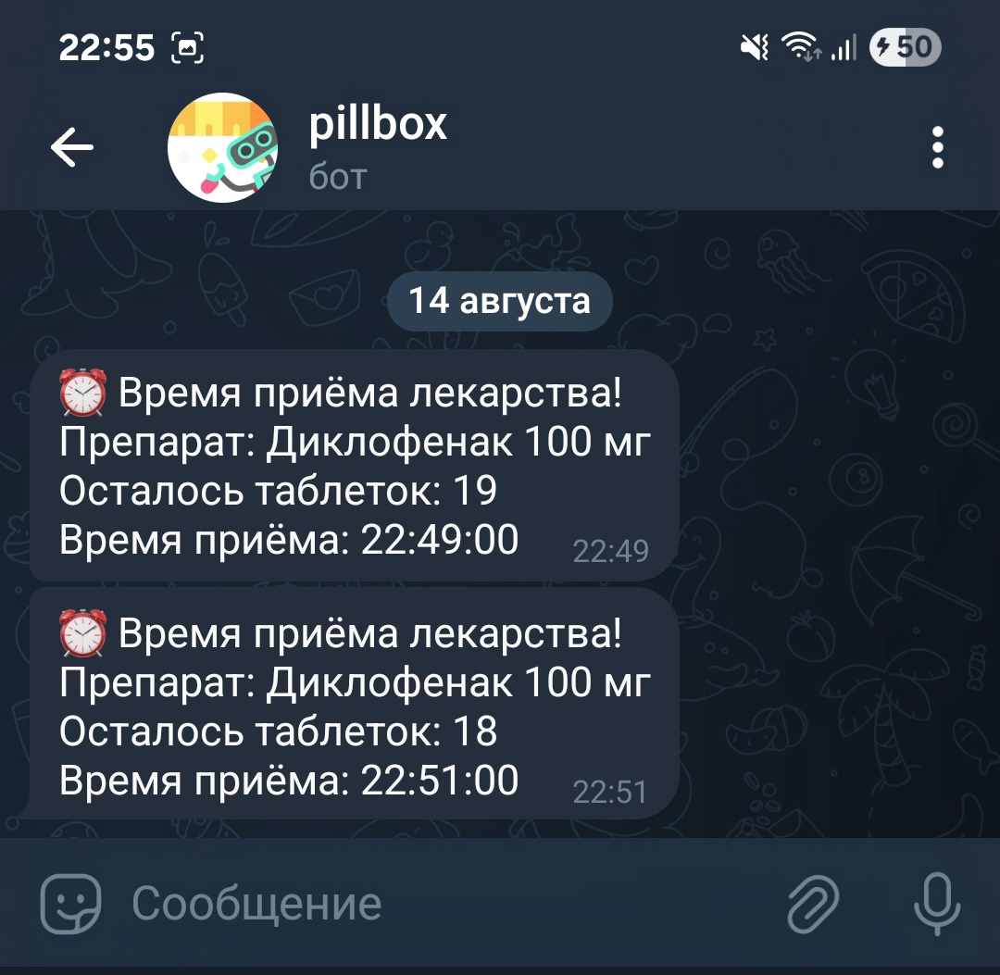
  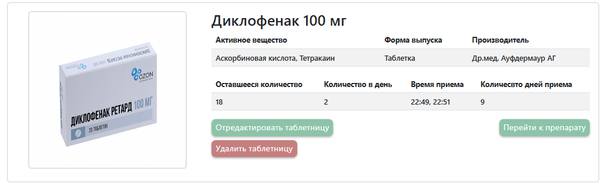

## Как запустить
- `$ pip install -r requirements.txt`
- `$ python manage.py migrate`
- `$ python manage.py createsuperuser`
- `$ python manage.py runserver`
---
- `$ celery -A pillboxtracker worker -l info --pool=threads --concurrency=4`
- `$ celery -A pillboxtracker beat -l info`

## Проект сделал:
### [✍️ Dzyundzya Alexandr](https://github.com/dzyundzya)